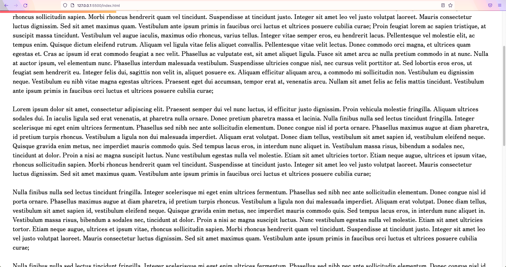

# Progress Bar Animation

A scroll-based animation, typically seen on article websites to let the user know how much of the article is left to be read. 


## Acknowledgements

 - [Dev Ed Youtube Channel](https://www.youtube.com/channel/UClb90NQQcskPUGDIXsQEz5Q)
 - [Google Fonts](https://fonts.google.com/)
 - [Lorem Ipsum Generator](https://www.lipsum.com/)
## Usage/Examples
First we need to grab each element required from our `index.html` page
```javascript
const article = document.querySelector(".article");
const progressBar = document.querySelector(".progress-bar");
```


Function to animate the progressBar width
```javascript
const animateProgressBar = () => {
  let scrollDistance = Math.abs(article.getBoundingClientRect().top); // Article page height (- viewport height)
  let progressWidth =
    (scrollDistance /
      (article.getBoundingClientRect().height -
        document.documentElement.clientHeight)) *
    100;
  progressBar.style.width = progressWidth + "%"; // Set progressBar style to progressWidth value;
};
```

To run animation on scroll, we need listen for scroll.
```javascript
window.addEventListener("scroll", animateProgressBar); // Enables animation on scroll
```
  ## Color Reference

| Gradient Colors             | Hex                                                                |
| ----------------- | ------------------------------------------------------------------ |
| Left Color |  #ff5f6d |
| Right Color | #ffc371 |

## Font Reference

| Font Name         | Use | Source                                             | Designed By      |
| ----------------- | -|------------------------------------------------- | ---------|
| Montserrat |Article Title Font|[Google Fonts](https://fonts.google.com/specimen/Montserrat?query=Montserrat) | Yoshimichi Ohira|
| Zen Old Mincho |Article Content Font|[Google Fonts](https://fonts.google.com/specimen/Zen+Old+Mincho?query=Zen) | Julieta Ulanovsky, Sol Matas, Juan Pablo del Peral, Jacques Le Bailly |

## Screenshots



  